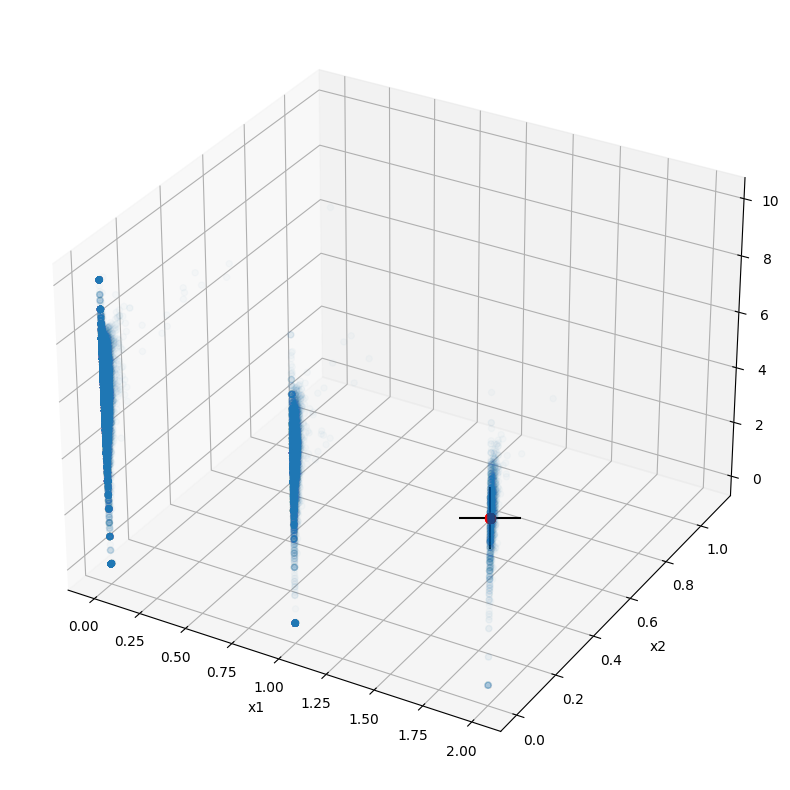
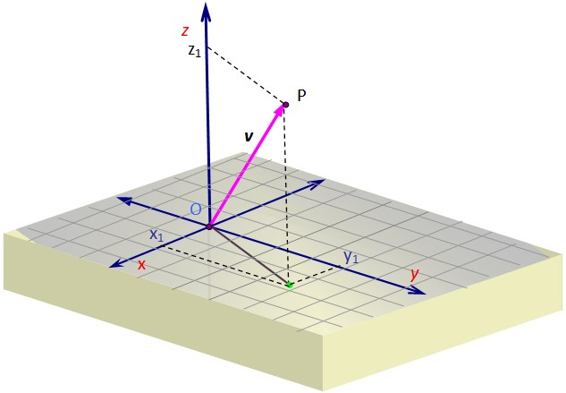

# <h1 align=center> **Proyecto Individual MLOps** </h1>
# <h1 align=center>**`Machine Learning Operations (MLOps)`**</h1>

# **Introducción**

En este proyecto, adoptaremos el rol de un Data Enginner y MLOps (Machine Learning Operations) realizando una serie de transformaciones para la obtención de información útil y un modelo capaz de recomendar películas similares a aquella seleccionada. 
Para esto habrá que realizar todos los procesos necesarios presentes en el ciclo de vida de un dato desde la carga, el tratamiento hasta la selección de los componentes o variables que se utilizaran en nuestro Modelo de Machine Learning para su posterior despliegue y uso. Cabe aclarar que el proyecto fue desarrollado en el lapso de una semana y, por tanto, puede tener mejoras pero lo que se busca es un Minimun Viable Product que se entragará a producción.

Adoptaremos el rol de una persona que es contratada como Data Scientist en una start-up que provee servicios de agregación de plataformas streaming. Nuestro objetivo principal será crear un modelo de Machine Learning capaz de proporcionar recomendaciones de películas similares a nuestros clientes. Al llegar nos damos cuenta que la madurez de los datos no es óptima, hay datos sin transformar, anidados y no tenemos un proceso automatizado para dar con los mismos por lo que nos tocará realizar una serie de transformaciones para obtener información.

# **Objetivos**

Nuestros objetivos principales son la generación de una API (Application Programming Interfaces) con una serie de funciones para su uso, el Deployment o despliegue de la misma para su uso y la realización de un modelo de recomendación de películas con Machine Learning.

### Se listaron una serie de tareas para llevar a cabo el proceso de ETL, las describiremos brevemente a continuación:

+ **Desanidar:** Algunos campos, como **`belongs_to_collection`**, **`production_companies`** y otros están anidados ya sea en forma de lista o diccionarios, por lo
que tendremos que encontrar la manera de hacer viable su uso para las consultas de la API.

+ **Control de los valores nulos:**

  1- Debemos eliminar los valores faltantes en los campos **`revenue`**, **`budget`** que serán posteriormente rellenados por un **`0`**.
  
  2- Se eliminaran los valores nulos del campo **`release date`**.

  
+ **Corrección en el formato de fechas:**

  Todas las fechas deberán tener el formato **`AAAA-mm-dd`**, y tendremos que crear una columna llamada **`release_year`** que indicará el año de estreno de las películas.

+ **Creación de la columna return:**

  Crearemos la columna con el retorno de inversión, llamada **`return`** con los campos **`revenue`** y **`budget`**, dividiendo estas
  dos últimas **`revenue / budget`**, cuando no hay datos disponibles para calcularlo, tomará el valor de **`0`**.

+ **Descarte de columnas no utilizadas:**

  Eliminaremos las columnas que no utilizadas: **`video`**,**`imdb_id`**,**`adult`**,**`original_title`**,**`poster_path`** y **`homepage`**.

En este archivo encontrarás el ETL: [ETL](https://github.com/germo24/Proyect_MLOps-Recommendation/blob/main/ETL.ipynb)

# **Desarrollo de nuestra API**

En esta etapa del proyecto, se propone montar y desplegar una API que responda a las peticiones del usuario disponibilizando la data de la empresa mediante el uso
de el Framework FastAPI.

Se han definido 6 funciones para los endpoints que serán consumidos en la API, cada una de ellas con un decorador `@app.get('/')`.

### A continuación, se detallan las funciones y las consultas que pueden realizarse a través de la API:

1. def **peliculas_idioma( *`Idioma`: str* )**:
   + Esta función recibe como parámetro un idioma y devuelve la cantidad de películas producidas en ese idioma.
   + Ejemplo de retorno: *`X` cantidad de películas fueron estrenadas en `idioma`*

 2. def **peliculas_duracion( *`Pelicula`: str* )**:
   + Se ingresa una pelicula. Debe devolver la duracion y el año.
   + Ejemplo de retorno: *`X` . Duración: `x`. Año: `xx`*

 3. def **franquicia( *`Franquicia`: str* )**:
   + Se ingresa la franquicia, retornando la cantidad de peliculas, ganancia total y promedio
   + Ejemplo de retorno: *La franquicia `X` posee `X` peliculas, una ganancia total de `x` y una ganancia promedio de `xx`*

 4. def **peliculas_pais( *`Pais`: str* )**:
   + Se ingresa un país, retornando la cantidad de peliculas producidas en el mismo.
   + Ejemplo de retorno: *Se produjeron `X` películas en el país `X`*

 5. def **productoras_exitosas( *`Productora`: str* )**:
   + Se ingresa la productora, entregandote el revunue total y la cantidad de peliculas que realizo. 
   + Ejemplo de retorno: *La productora `X` ha tenido un revenue de `x`*

 6. def **get_director( *`nombre_director`* )**:
   + Se ingresa el nombre de un director que se encuentre dentro de un dataset debiendo devolver el éxito del mismo medido a través del retorno. Además, deberá devolver el nombre de cada película con la fecha de lanzamiento, retorno individual, costo y ganancia de la misma, en formato lista.

En este archivo encontrarás el uso de FastAPI y la aplicación de las funciones: [FastAPI](https://github.com/germo24/Proyect_MLOps-Recommendation/blob/main/main.py)

# EDA (Exploratory Data Analysis) y Sistema de recomendación

Una vez realizada la limpieza de los datos deberemos investigar acerca de las relaciones en nuestros variables, patrones que se puedan encontrar y prepararemos los datos para el modelado.

El sistema de recomendación generado usa la distancia vectorial entre los puntos para recomendar una película similar a la actual. Consiste en obtener los n puntos más cercanos al nuestro usando una serie de coheficientes. Es un sistema que posee aplicaciones diversas y tiene la capacidad de adaptarse a el criterio de cada persona a diferencia del uso de una clusterización y al tratarse de calculo vectorial puede generalizarse para tomar puntos en n dimensiones.

Gráficamente, tenemos todos los registros como puntos celestes, nuestro punto de referencia marcado por una cruz y una serie de recomendaciones en rojo, que como pueden ver son cercanas a la película actual.

 Representación ficticia del modelo trazando un vector entre los puntos 'P' y 'O' 

En este archivo encontrarás el EDA y una explicación más detallada de nuestro sistema de recomendación: [EDA](https://github.com/germo24/Proyect_MLOps-Recommendation/blob/main/EDA.ipynb)

# **Archivos de interés y fuentes:**

+ [Deployment](https://rendermlops.onrender.com/docs): El proyecto ha sido desplegado en un entorno en línea utilizando **Render**.

+ [Dataset original](https://drive.google.com/drive/folders/1nvSjC2JWUH48o3pb8xlKofi8SNHuNWeu): Aquí encontrarás una carpeta con los 2 archivos usados(movies_dataset.csv y credits.csv)

+ [Diccionario de datos](https://docs.google.com/spreadsheets/d/1QkHH5er-74Bpk122tJxy_0D49pJMIwKLurByOfmxzho/edit#gid=0): Diccionario con algunas descripciones de las columnas disponibles en el dataset.

+ [Video explicativo]() Un video propio explicando algunos conceptos sobre el proyecto.
